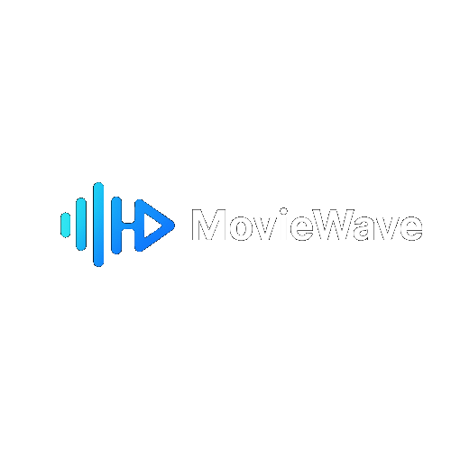
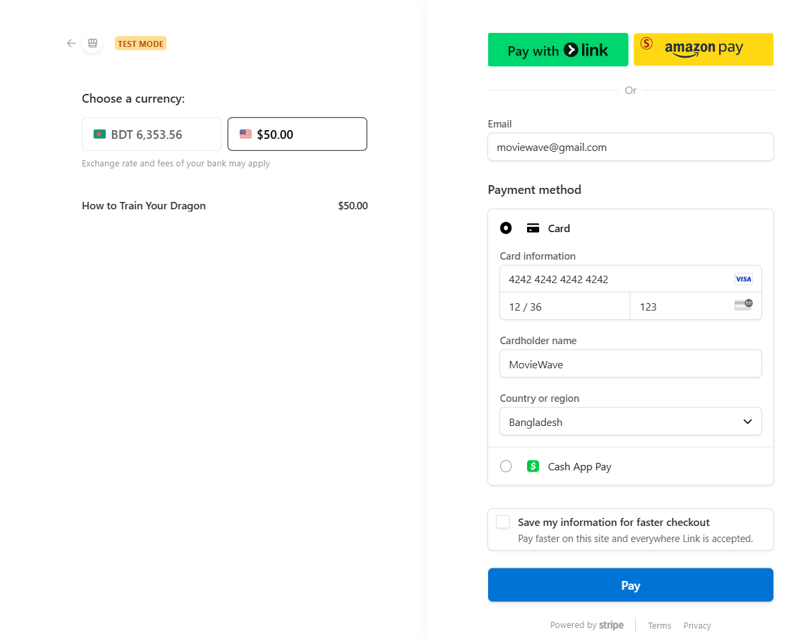

# 
## [🌐 Live Demo](https://movie-wave-red.vercel.app)

**MovieWave** is a full-stack Online Movie Ticket Booking System using MERN for movie discovery, online booking, and theater management. Built with autonomous task management and feature riched and responsive UI.

## Top Features

- Inspired by **iOS 26**'s **liquid glass** aesthetic, the design prioritized usability and simplicity.

- **Clerk** handles all the authentication system in app. For simplicity, I kept **google sign-in and email and password based sign in** only. Also I utilized **Clerk** for, secure role-based login for both Admin and normal user login.

- Used **Inngest** for autmatic seat release after 10 minutes, when the user didn't paid for the ticket, also my **Inngest Functions** also handle automatic user insertion, deletion and updation in the database

- For the movie information like movie details, images etc , I have used TMDB Api 

- Used **Stripe** for payment gateaway, currently using the test mode of **Stripe**

- Admins can manage users, shows, bookings, and more from a clean, intuitive dashboard.

## Stripe Payment Gateway Guide For My App
Use **4242 4242 4242 4242** as your card number
Use any valid date for the date field (for example - **12/34**)
Use any valid number for the **CVC** field (for example: **123**)

